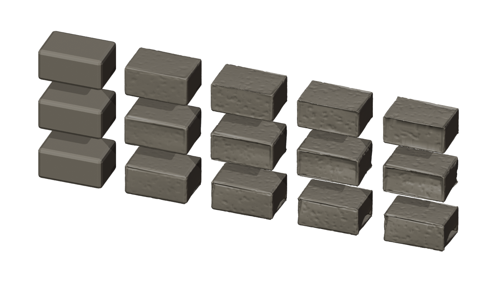
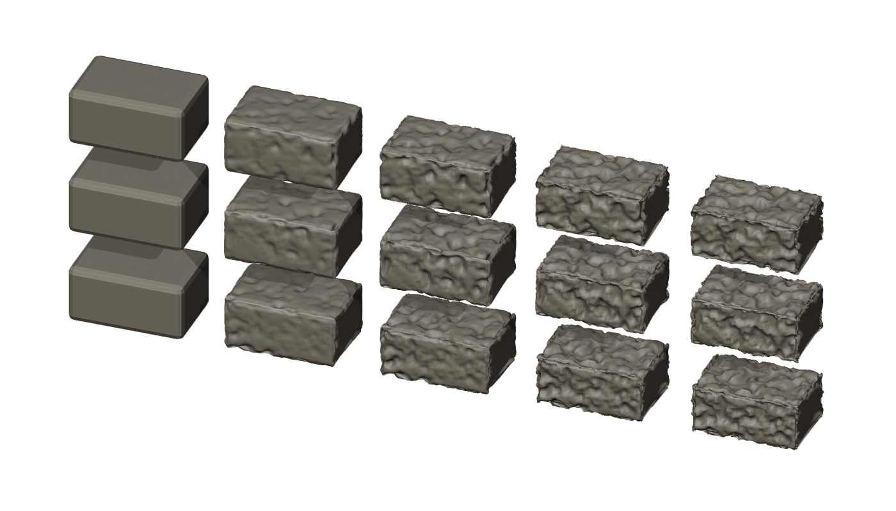

# Validación del desgaste 0.31

Blender 5.2.2, 4 hilos, piedra biselada de 12 × 8 × 6 mm, semillas 17/43/91,
misma resolución configurada y cámara. Antes: código de `9b365b8`. Después: 0.31.
Los renders muestran de izquierda a derecha intensidades 0 / 0,3 / 0,55 / 0,85 / 1.





Promedios de tres semillas; pérdida de volumen respecto a la piedra biselada intacta:

| Intensidad | Pérdida antes | Pérdida 0.31 | Caras antes | Caras 0.31 | Tiempo antes / 0.31 |
|---|---:|---:|---:|---:|---:|
| Ligero (0,3) | 7,5 % | 8,3 % | 7.110 | 7.600 | 68 / 47 ms |
| Medio (0,55) | 13,4 % | 17,4 % | 7.114 | 7.600 | 60 / 34 ms |
| Fuerte (0,85) | 19,8 % | 28,4 % | 7.012 | 7.600 | 65 / 34 ms |
| Máximo (1) | 22,5 % | 33,3 % | 6.756 | 7.600 | 54 / 34 ms |

Son tiempos orientativos de una ejecución, no una garantía de velocidad. La densidad
objetivo no aumenta; refinar antes de erosionar conserva una rejilla uniforme entre
intensidades positivas. El escenario `window_detail` pasa de 508.287 a 549.847 caras
(+8,2 %); los tres escenarios Borrador/Trabajo conservan sus digests.

La comparación de piedras exige cierre, ausencia de caras degeneradas, volumen positivo,
pérdida monótona y topología constante entre intensidades positivas. La integración
comprueba un muro personalizado con 0 / 0,55 / 1, invalidación y reproducción exacta de
caché y sólido cerrado de una sola componente al máximo. La regresión general cubre
ventanas, grietas, vigas, exportación y ciclo de vida, sin nuevas caras degeneradas.

Reproducir (sustituir los ejecutables por sus rutas si no están en PATH):

```powershell
python dev.py test
blender -b -t 4 --python-exit-code 1 --python tests/blender_weather.py -- after --integration
```

Datos crudos en `reports/weather_before.json` y `reports/weather_after.json`.
El acabado al regenerar cambia, aunque las semillas siguen siendo locales y deterministas.
El límite por espesor corresponde a la erosión principal, no certifica el espesor mínimo
del sólido final tras grietas y agujeros. La prueba física de impresión sigue pendiente.
